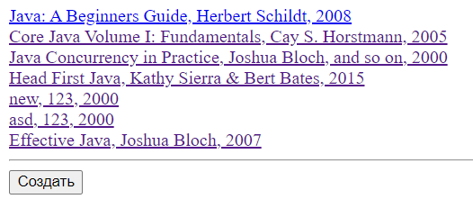
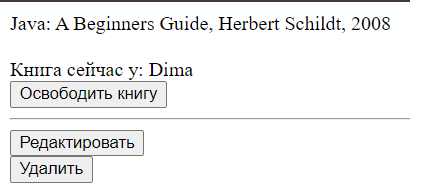
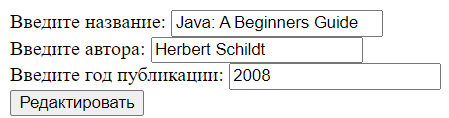
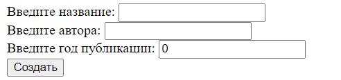
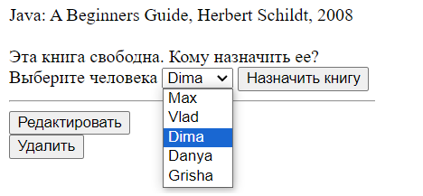
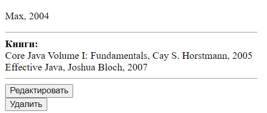
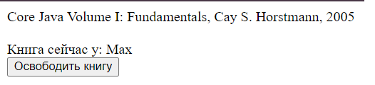
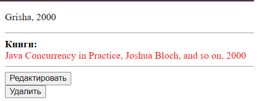

# Library (Spring Boot CRUD tutorial app)
* Small application that automates book accounting.
* Created for learning purposes. 

## Requirements
* JDK 17
* Apache Maven 3.6.3
* PostgreSQL 10+

## Tech stack
* Spring 
  * Boot 3
  * Data (JPA / Hibernate)
* Databases
  * PostgreSQL
* Thymeleaf
* Hibernate Validator
  
## Installation
Clone repository form GitHub.
```shell
git clone https://github.com/1aazy/Library.git
```
Rename "application.properties.origin" to "application.properties" 
and fill out this file with your data source settings.
```shell
spring.datasource.url=
spring.datasource.username=
spring.datasource.password=
```
You can create a tables using "database.sql" file.
```shell
src/resources/static/database.sql
```

## Functionality
App has 2 main endpoints to view list of entities:
```shell
http://localhost:8080/people

http://localhost:8080/books
```

Books:</br>


You can performe any CRUD operations on entities: </br>

To view one single entity clicking on it: </br>


To delete entity click "Удалить"</br>

To edit entity click "Редактировать", fill in the fields and click the button:</br>


To create new entity click "Создать", fill in the empty fields and click the button:</br>


You can assigned books to person:</br>


And release books:</br>

If a person has a book for more than 10 days, it is considered expired and is marked in red.</br>


## Database
Database has this structure (one-to-many relations):</br>


